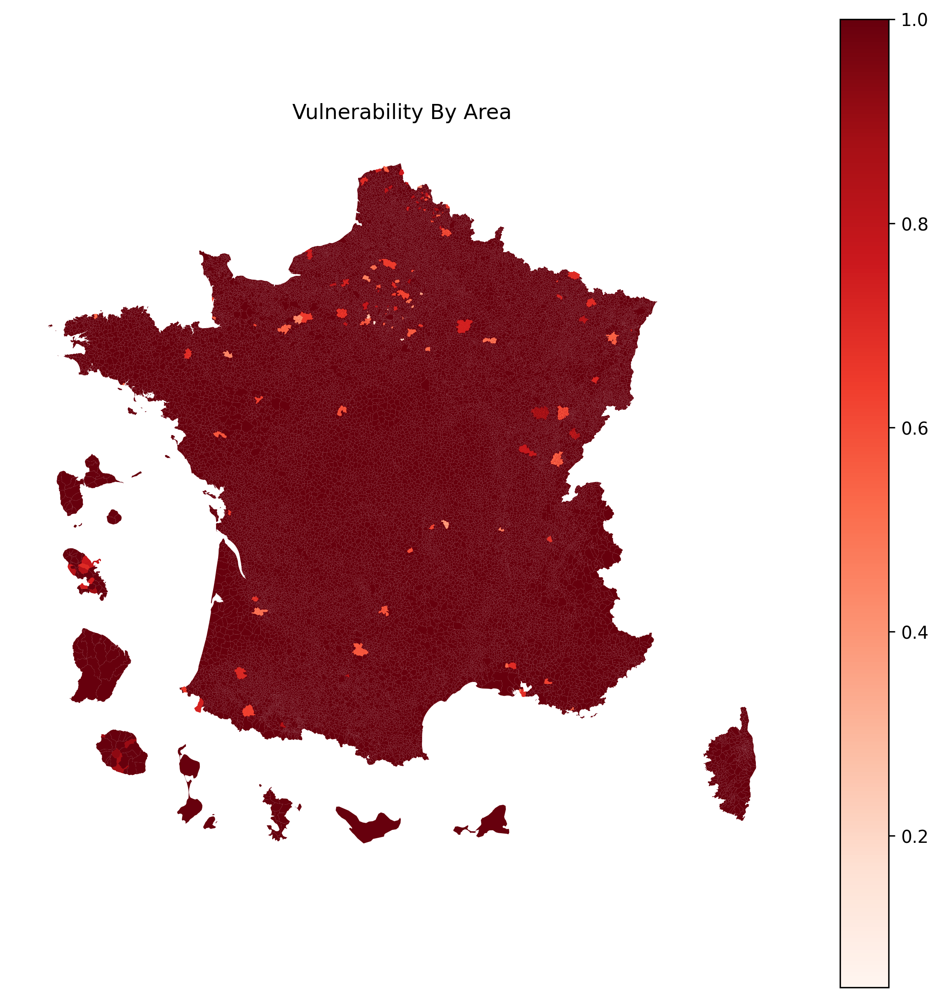
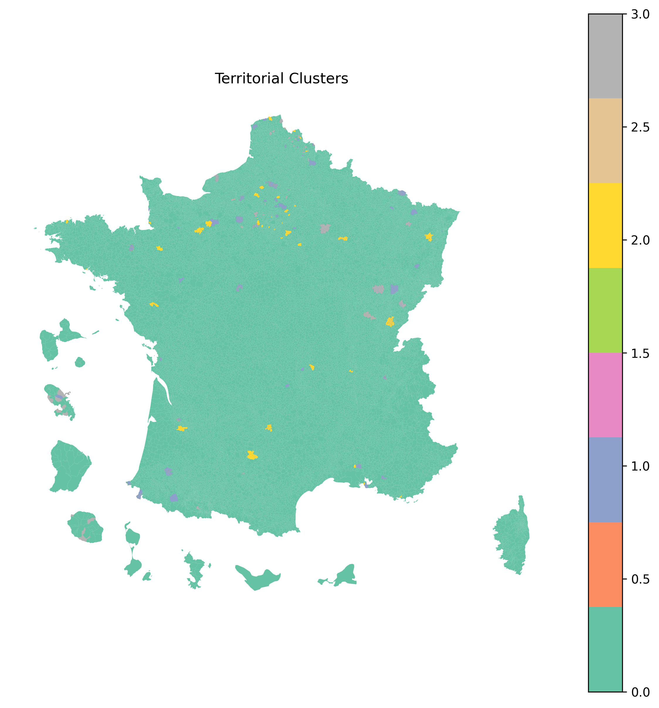

# 🧭 Geospatial Analysis for Targeting Social & Health Services

## 📌 Overview

Public and social programs often face a critical challenge:  
**limited resources combined with unequal access to essential services across territories.**

This project demonstrates how geospatial data can be used to identify underserved areas and support more effective, data-driven decision-making.

---

## 🎯 Objective

To identify territories with limited access to health and social services in order to improve the targeting and impact of public interventions.

---

## 💡 Approach

The model is based on indicators related to service accessibility, including:

- healthcare facilities  
- medical and paramedical services  
- social services for elderly populations  
- social services for people with disabilities  

A composite **service accessibility index** is built and inverted to estimate territorial vulnerability.

---

## 📊 Key Insights

- Significant disparities exist in access to essential services across territories  
- Several areas show **low service density**, indicating high vulnerability  
- Clustering reveals **4 distinct territorial profiles**:
  - well-served areas  
  - intermediate territories  
  - underserved areas  
  - structurally imbalanced zones  

---

## 🗺️ Key Outputs

### Vulnerability Map

Areas with limited access to services exhibit higher vulnerability levels, highlighting priority zones for intervention.

---

### Territorial Clusters

The clustering analysis identifies distinct territorial profiles based on service accessibility patterns.

---

### Top Priority Areas

These areas represent the most underserved territories and should be prioritized in resource allocation strategies.

---

## 💥 Business Value

This approach enables organizations to:

- better target high-impact intervention areas  
- optimize allocation of limited resources  
- support data-driven policy and program decisions  

---

## ⚠️ Limitations

The analysis focuses on the presence of services but does not account for service quality or capacity.  
Additional data could further refine the model.

---

## 🛠️ Tools

Python (GeoPandas, Pandas, Scikit-learn), Matplotlib

---

## 📬 Contact

If you are working on territorial planning, social programs, or public policy, feel free to connect:

🔗 https://www.linkedin.com/in/djimtebaye-naguertangar-4bb913120/
